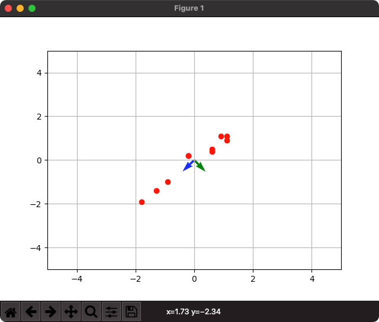
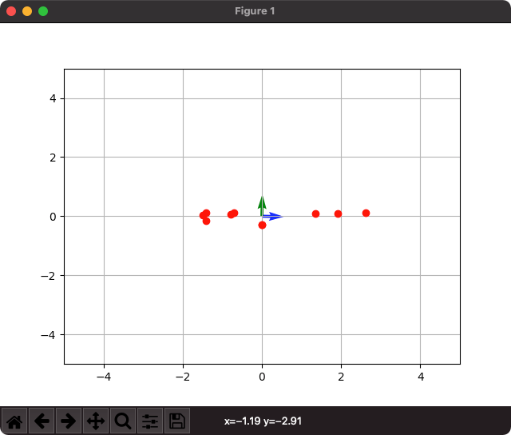
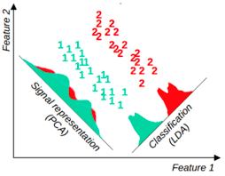

# 고유값, 고유벡터로 PCA 

고유값을 구하여 주성분인 고유벡터 구하기

[블로그 정리](https://blog.naver.com/pjt3591oo/222636875246)

1. 데이터 표준화(z-score)를 구한다

2. 공분산 행렬을 구한다

3. 고유값을 구한다

4. 고유벡터를 구한다.

고유벡터는 공분산 행렬을 잘 설명할 수 있다. 즉, 기존 데이터를 가장 잘 설명할 수 있는 벡터를 의미한다.

**`PCA0.py 실행결과`**

PCA1.py에서 생성한 2개의 주성분으로 다시 그래프를 그리면 다음과 같이 그려진다.

새롭게 구한 PC1, PC2를 이용하여 그래프위에 데이터를 표현할 수 있다

# 더 공부해야 할 개념 

* SVD(Singular Value Decomposition): 특잇값 분해

* LDA(Linear Discriminant Analysis): Latent Dirichlet Allocation가 아닌 Linear Discriminant Analysis이다. Latent Dirichlet Allocation는 SVD를 활용하여 문서의 주제를 파악하는 알고리즘이다. Linear Discriminant Analysis는 PCA와 마찬가지로 차원축소 기법

